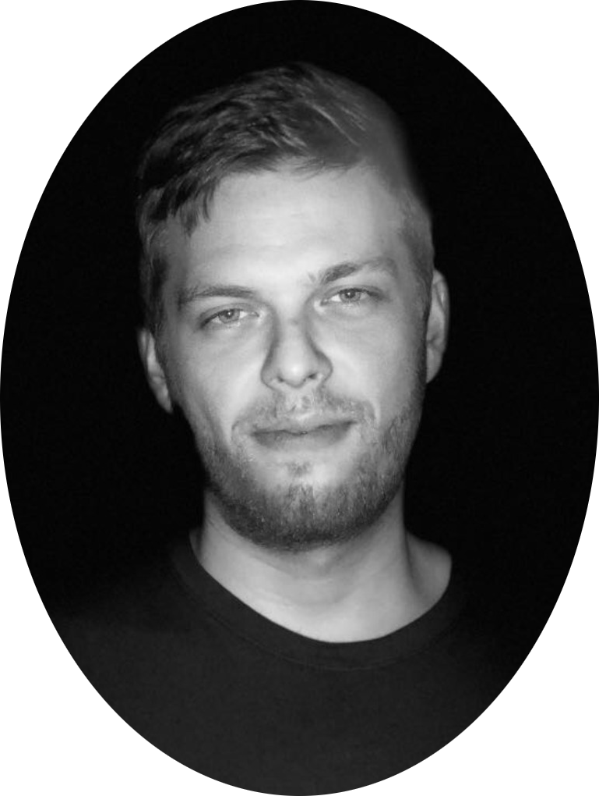

---
# Feel free to add content and custom Front Matter to this file.
# To modify the layout, see https://jekyllrb.com/docs/themes/#overriding-theme-defaults

layout: default
title: Home
permalink: /
---

# Hello!

  

    

        Hi my name is Oliver Stritzel and I am a Data Engineer and Data Scientist based in Nuremberg, Germany. I try to teach machines to do useful stuff to make your life easier.
    

    

        I have worked as a data scientist for over 5 years and as a data engineer for 3 years previously. 
    

  

  

    
  

 

---

 

Feel free to check out my <a href="/files/cv_en.pdf" download>cv</a>, my [projects]({{ site.baseurl }}/projects/) or [reach out]({{ site.baseurl }}/contact/)!

